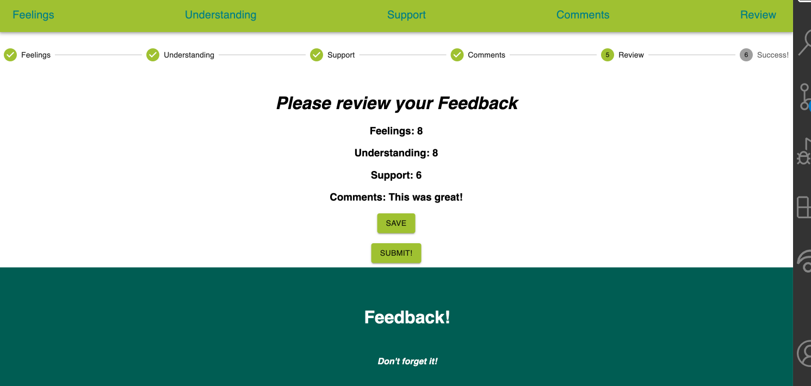

# Project Name
React Feedback Loop

## Description
Duration: 2 Week Sprint
 This is a feedback form modeled after Prime's system. Feedback will be collected over 4 views. In a separate review page, display the current feedback values and a submit button. and when all steps are complete, your app will save the feedback in the database.

 ## Screen Shot 

## Installation
1. Create a database named "feedback"
2. The queries in the tables.sql file are set up to create all the necessary tables and populate the needed data to allow the application to run correctly. 
3. The project is built on Postgres, so you will need to make sure to have that installed. We recommend using Postico to run those queries as that was used to create the queries
4. Open up your editor of choice and run an npm install
5. Run npm run server in your terminal
6. Run npm run client in your terminal
7. The npm run client command will open up a new browser tab for you!

## Languages
- JavaScript
- HTML
- CSS
- Postgressql

## Packages
- React
- Redux
- Material UI
- Node.js
- Express
- Nodemon 
- Axios

## Acknoledgement
Thanks to Prime Digital Academy who equipped and helped me to make this application a reality.

## Support
If you have suggestions or issues, please email me at jgonzalezkincaid@gmail.com

